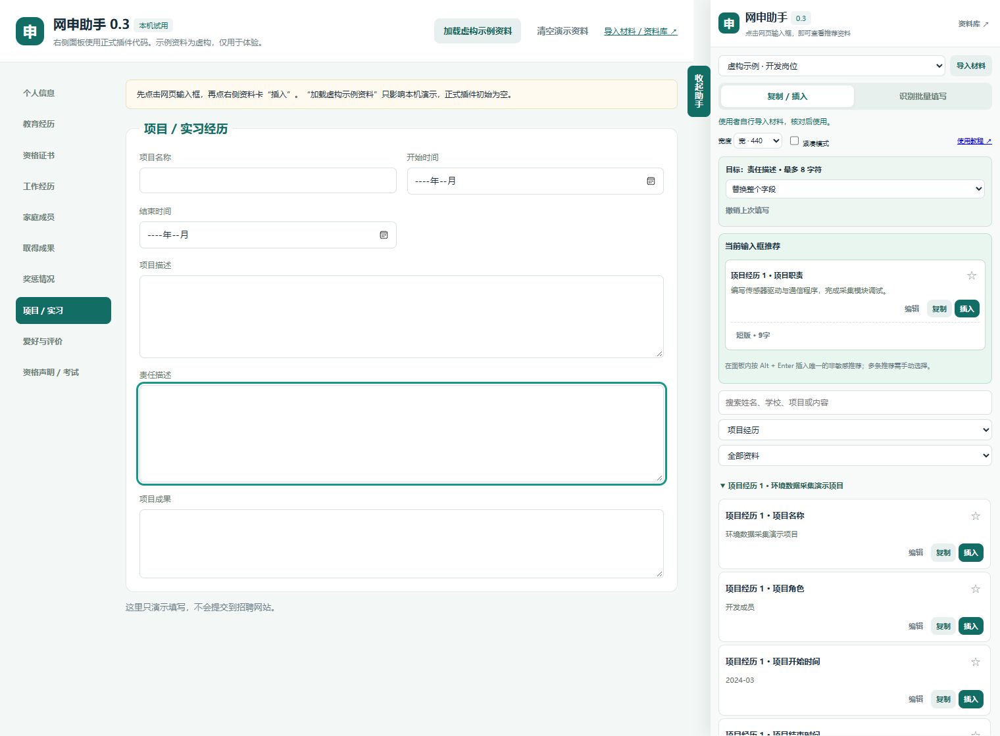

# 网申助手

用于 Chrome / Edge 的本地网申填写扩展。自行导入材料，核对后通过网页右侧面板复制、光标插入或批量填写。



## 下载与安装

1. 打开 [Releases 下载页](https://github.com/keyingdm/wangshen-zhushou/releases/latest)，下载 Assets 中的 `chrome-edge-extension-v0.3.0.zip`，解压到固定文件夹。
2. Chrome 打开 `chrome://extensions`；Edge 打开 `edge://extensions`。
3. 开启开发者模式，点击“加载已解压的扩展程序”，选择解压后包含 `manifest.json` 的文件夹。
4. 在浏览器工具栏固定“网申助手”。打开网申网页，点击图标即可打开右侧面板。

Releases 同时提供更新说明与 `SHA256SUMS.txt` 校验文件。也可以下载[仓库内的 v0.3.0 安装包](网申助手_通用插件_v0.3.0.zip)，或使用 **Code → Download ZIP** 下载整个项目，解压后加载 `extension` 文件夹。插件正常使用无需 Node.js、Python 或构建命令。

**第一次使用：[跟着图文教程完成安装、导入与填写](使用说明.md)**。插件面板和资料库中的“使用教程”也可打开随包提供的离线教程。

升级前先备份资料，将新文件覆盖到原加载目录，再在扩展管理页刷新，保持同一扩展 ID；不要先卸载。每次更新的变化见 [更新日志](CHANGELOG.md)。

## 功能

- **空资料库开始**：使用者自行选择文件，不预装个人资料。
- **本机材料提取**：支持 DOCX、文字 PDF、TXT / MD、JSON、图片，以及扫描 PDF 的中英 OCR。识别草稿经人工核对后保存。
- **右侧可折叠面板**：搜索、分类、复制、编辑、替换字段、光标插入和撤销。
- **识别后批量填写**：检查字段对应关系与预览后填写；已有内容默认保留，敏感字段逐项核对。
- **网申栏目**：个人资料、教育、项目、校园、工作、证书、家庭、成果、奖惩、爱好评价、资格声明和考试城市。
- **求职管理**：岗位资料版本、手动投递记录与本地附件库。
- **自带 API Key 的 AI 精简**：自行配置兼容 Chat Completions 的服务，只发送工作区中的一段文字；先预览，再手动采用。
- **v0.3 体验改进**：输入框对应推荐、经历分组、常用置顶、最近使用、自动保存与草稿恢复、网页字数提示、短版 / 标准版 / 详细版、导入去重与冲突选择、待处理定位、可调宽度和紧凑模式。

## 数据与权限

资料保存在本机浏览器的扩展存储中，附件保存在本地 IndexedDB；解析与 OCR 的程序、模型均随安装包提供。AI Key 默认仅保存在浏览器会话中，主动选择记住时才在本机持久保存，不进入资料 JSON 备份。

扩展使用 `activeTab`、`scripting`、`storage`。配置 AI 时单独请求所选服务域名的访问权限。网页最终保存 / 提交、登录、验证码与附件选择由使用者操作。

本仓库包含通用程序与虚构演示，不包含个人简历、个人资料库、API Key、浏览器配置或本机日志。

## 兼容范围

适用于桌面 Chrome / Edge（Chromium 128 及以上）。原生输入框、下拉框、单选框和部分同源 iframe 可识别；复杂学校 / 省市联动、日期弹窗、跨域 iframe 等可能需要复制后手动处理。OCR 和规则识别结果需要核对。

验证覆盖材料解析、图片 / 扫描 PDF OCR、真实扩展链路、本机模拟 AI 及 v0.3 的体验改进，具体数量与范围见验证记录。实际招聘网站控件及具体模型服务仍需实际使用验证。

## 文档

- [安装、导入与使用说明](使用说明.md)
- [完整更新日志与升级影响](CHANGELOG.md)
- [v0.2 更新说明](更新说明_v0.2.md)
- [验证记录](验证记录.md)
- [第三方依赖与许可证](extension/THIRD_PARTY.md)

## 本地演示

已安装 Python 时，双击 `启动演示.cmd`，打开 `http://127.0.0.1:8088/demo/v2.html`。首次为空，可点击“加载虚构示例资料”体验；演示资料库与已安装插件分开。

也可以在项目目录运行：

```powershell
python tools/serve_demo.py --port 8088
```

## 开发与打包

测试需要 Node.js、Python 和桌面 Edge。`BROWSER_PATH` 可用于指定其他 Chromium 浏览器（部分界面检查默认使用 Windows Edge）。

```powershell
npm install
npm test
npm run test:browser
npm run test:extension
npm run test:v2
npm run test:demo
npm run test:ux
python tools/build_help.py
python tools/package_extension.py
```

`extension/vendor` 内提供本地解析和 OCR 依赖；`extension/vendor/SHA256.json` 记录文件哈希。打包脚本仅打包 `extension`，不会包含测试、演示或任何用户资料。

## GitHub Packages

开发资源包名为 `@keyingdm/wangshen-zhushou`，注册表为 `https://npm.pkg.github.com`；内容是插件文件与文档，日常安装仍使用 Releases ZIP。正式 Release 发布后，工作流检查版本一致与分发文件白名单，再用临时 GITHUB_TOKEN 发布同版本 npm 包。

GitHub npm 包安装需要认证，首次发布默认私有，可在 Package settings 调整可见性。具体使用方式见教程第 13 节和 [GitHub 官方说明](https://docs.github.com/en/packages/working-with-a-github-packages-registry/working-with-the-npm-registry)。
