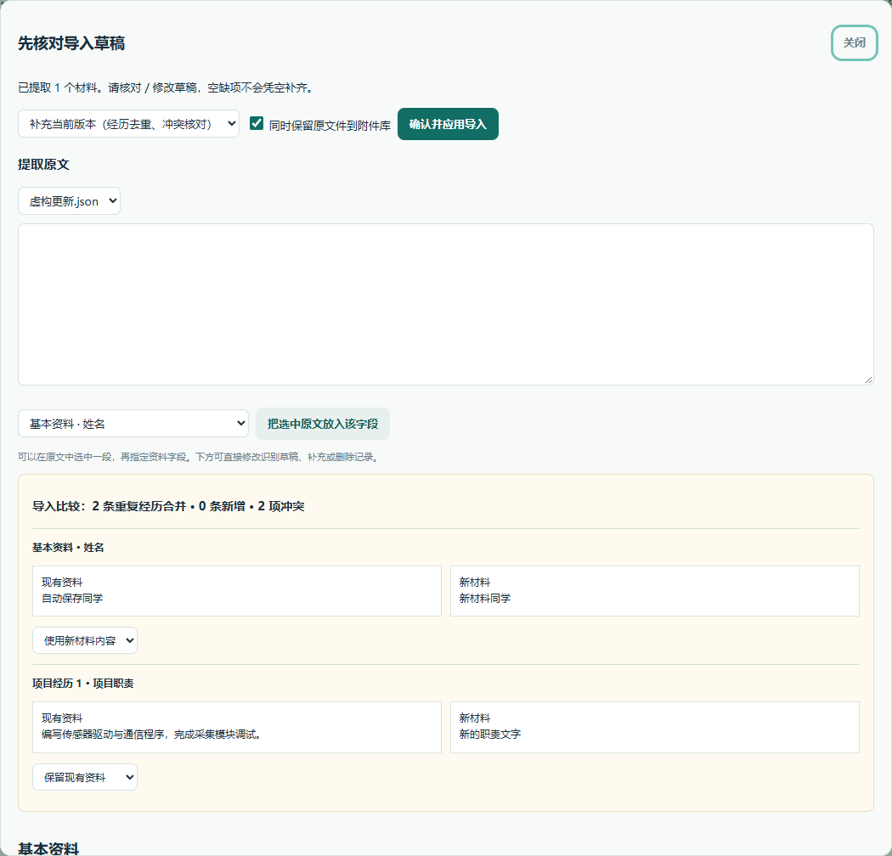
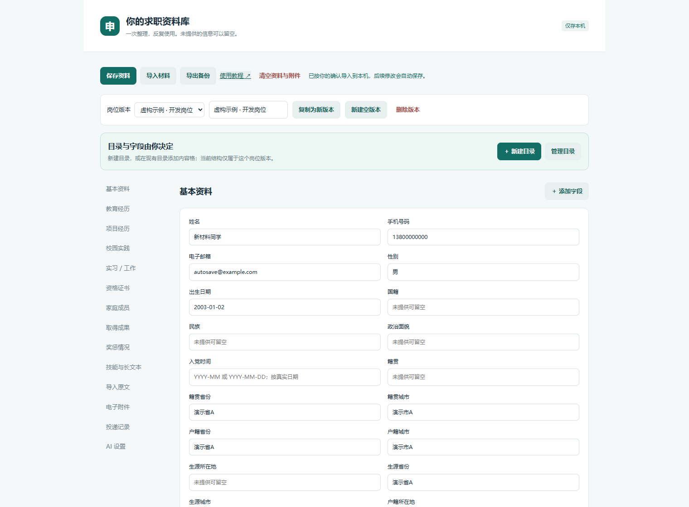
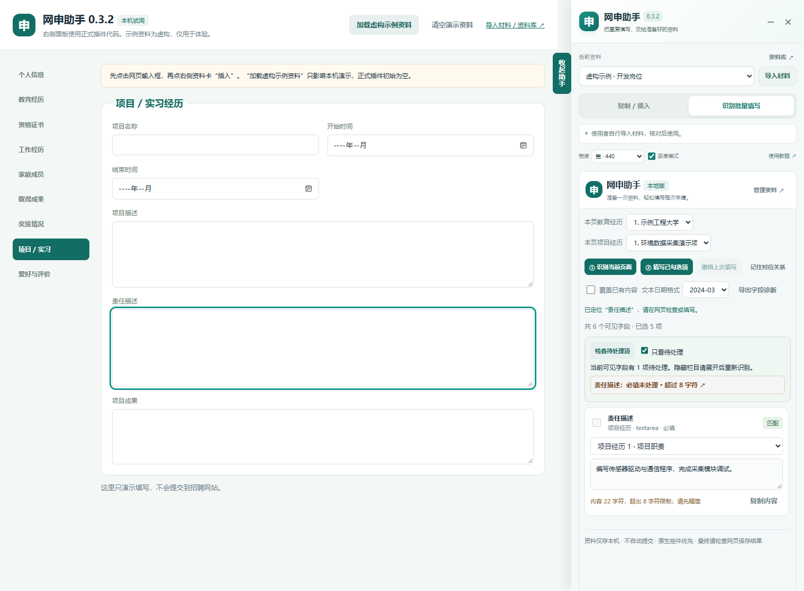

# 网申助手 v0.3.2 使用教程

网申助手是一款 Chrome / Edge 浏览器插件。把自己的简历等材料导入并核对一次，以后填写网申时，就能从网页旁边复制资料、插入内容，或检查后批量填写。

初次安装的资料库是空的，需要由使用者自己导入。文中的截图使用虚构示例；左侧招聘表单是本机演示，不代表某个实际招聘网站。

第一次使用，按第 1–4 节操作即可完成一次填写。不使用 AI，也能使用导入、OCR、复制、插入和批量填写；正常安装不需要 Node.js、Python 或命令行。

v0.3.1 已移除“资格与声明”栏目，相关快捷卡片、导入分配和填写对应项同步取消。旧资料库里的历史字段仅兼容保留在 JSON 备份中，不再显示或用于填写；其他资料继续保留。

## 1. 首次安装

1. 用电脑上的 Chrome 或 Edge 打开 [Releases 下载页](https://github.com/keyingdm/wangshen-zhushou/releases/latest)。
2. 找到页面下方的 **Assets**。下载 `chrome-edge-extension-v0.3.2.zip`，不要把 `Source code (zip)` 当作插件安装包。
3. 找到下载的 ZIP，右键选择“全部解压缩”。建议放到固定目录，例如 `D:\工具\网申助手`。只要以后还使用插件，就保留这个文件夹。
4. 打开解压后的文件夹。应当直接看到 `manifest.json`、`panel.html`、`options.html` 和 `vendor` 文件夹。浏览器要加载的是包含 `manifest.json` 的这一层。
5. Chrome 在地址栏输入 `chrome://extensions` 后回车；Edge 输入 `edge://extensions` 后回车。地址应输入浏览器地址栏。
6. 找到“开发者模式”并打开。点击“加载已解压的扩展程序”，选择第 4 步确认的文件夹。
7. 扩展列表出现“网申助手 · 本地资料库”，版本显示 **0.3.0**，表示加载成功。
8. 点击浏览器工具栏的扩展按钮，找到网申助手并固定到工具栏。Chrome 通常是图钉；Edge 可使用显示在工具栏的开关。

如果你下载的是整个项目的 `Source code (zip)`，解压后应选择项目里面的 `extension` 文件夹。两种下载方式都能使用；直接下载插件安装包更省步骤。

安装提示“找不到清单文件”时，通常选错了文件夹或还没有解压。回到第 4 步，确认选中的文件夹里直接有 `manifest.json`。

## 2. 第一次导入自己的资料

1. 打开一个普通网页，点击工具栏里的网申助手图标，右侧会出现面板。
2. 点击面板顶部的 **导入材料**。会打开“你的求职资料库”页面。
3. 点击资料库顶部的 **导入材料**，在文件选择窗口中选择自己的简历；可以按住 Ctrl 多选材料。
4. 等待读取。DOCX / 文字 PDF 会提取正文，图片 / 扫描 PDF 会运行本机 OCR。扫描件较长时需要更久，请等待状态提示完成。
5. 出现 **先核对导入草稿** 窗口后，对照原材料检查姓名、电话、学校、日期、项目职责和成果。此时还没有写入正式资料库。
6. 向下滚动查看各类草稿。发现错误，直接在对应输入框改正；没有识别出的内容可手动补充。“+ 添加一条”用于补充教育、项目、证书等记录。
7. 选择导入方式，核对冲突项，再点击 **确认并应用导入**。窗口关闭、提示导入完成后，资料才正式保存。



### 2.1 选哪种导入方式

| 方式 | 适合什么情况 | 会发生什么 |
| --- | --- | --- |
| 补充当前版本 | 首次导入，或补充新版简历、证书 | 填补空值；明确对应的经历去重；值不一致时供你选择 |
| 替换当前版本 | 当前版本不需要了，想整份换成新材料 | 使用核对后的整份草稿替换当前版本的资料字段；草稿空缺也会成为空值 |
| 导入为新版本 | 想保留原版，同时增加一份岗位资料 | 新建岗位版本，原版本继续保留 |

例如现有手机号和新材料手机号不同，比较区会同时显示两个值。默认“保留现有资料”，确定新材料正确时改选“使用新材料内容”。每个冲突分别选择，最后统一确认导入。

相同项目名称且时间等信息能明确对应时，会合并重复经历；同名但时间不同、或无法确定对应的记录，会保留为独立经历，供你核对。多份材料互相冲突时，也会给出草稿内容选择。

勾选“同时保留原文件到附件库”，可以在插件里保留文件副本。相同文件按内容校验去重。原始磁盘文件仍由你保管。

### 2.2 识别漏了怎么办

1. 在“提取原文”中选择相应材料。
2. 用鼠标选中需要的那段文字，例如一段项目职责。
3. 在下方选择框中选择“项目经历 1 · 项目职责”。
4. 点击“把选中原文放入该字段”。文字会进入下方草稿，仍可修改。
5. 确认整份草稿后，点击“确认并应用导入”。

没有提取出原文时，可以直接在下方草稿输入。插件不会凭空补充没有提供的经历、日期或分数。

### 2.3 文件格式和大小

| 材料 | 支持情况 |
| --- | --- |
| Word | DOCX；旧 DOC 请先另存为 DOCX |
| PDF | 文字 PDF、扫描 PDF；混合扫描材料可以勾选资料库底部“每页 OCR” |
| 图片 | PNG、JPG / JPEG、WEBP、BMP，识别简体中文与英语 |
| 文本 | TXT、MD |
| 资料备份 | JSON；完整资料库备份需要单独选择，不与其他材料混选 |

单个材料最大 30 MB，PDF 最多 50 页；一次最多 8 个材料、合计 100 MB；JSON 最大 8 MB。OCR 结果需要人工核对，尤其是数字、姓名和日期。

## 3. 检查和维护资料库



左侧目录可以跳到“基本资料”“教育经历”“项目经历”等栏目。输入或修改内容后，顶部会先显示“正在自动保存…”，成功后显示 **已自动保存到本机**。也可以点击“保存资料”立即保存。

日期按真实精度填写。例如只知道 `2024-03`，就填年月；网站要求具体某一天时，再按照真实资料补充，插件不会自动编造日期中的“日”。

“删除这一条”会删除对应经历；“删除版本”会删除整个岗位版本。操作前会提示确认。修改字段对应关系相关的经历结构后，批量页需要重新识别、核对。

有多个资料库窗口时，不同字段的修改可以合并。如果两个窗口同时改同一项，会提示冲突并保留当前编辑。先点击“导出备份”保留当前内容，再刷新窗口，对照另一个窗口的结果核对；不要直接丢弃尚未保存的修改。

## 4. 完成第一次网页填写

建议先用“复制 / 插入”熟悉操作，再使用批量填写。

1. 打开招聘网站，完成登录，进入真正填写个人信息或简历的页面。
2. 点击工具栏里的网申助手图标。面板顶部选择准备好的岗位资料版本。
3. 点击网页上的一个输入框，例如“姓名”。面板的“目标”会更新为这个字段，并在顶部出现对应资料推荐。
4. 核对推荐内容，点击推荐卡上的 **插入**。回到网页检查内容是否正确。
5. 点击下一个输入框，重复上述步骤。多个项目都可能对应“项目职责”时，按项目名称和内容手动选择。
6. 填错时，点击 **撤销上次填写**。插件会尝试恢复上一次操作前的值；之后你手动修改过的值会保留。
7. 填完后，在招聘网站核对并点击它自己的保存、下一步或提交按钮。


面板看不到推荐时，仍可使用搜索和分类找到资料卡。“复制”会放入系统剪贴板，回到网页点击目标框后按 Ctrl + V 粘贴；“插入”则直接写入刚才选定的网页字段。

### 4.1 替换和光标插入怎么选

| 插入方式 | 例子 |
| --- | --- |
| 替换整个字段 | 网页里已有“旧介绍”，插入“新介绍”后，整个框变成“新介绍” |
| 插入光标 / 替换选中内容 | 网页里是“前后”，把光标放在中间，插入“中”，结果为“前中后” |

光标模式用于普通文本框。下拉框、单选项和日期控件按整项处理。点击插入前，先看面板显示的目标是不是你要填的那个框。

### 4.2 更快找到资料

- **当前输入框推荐**：点击网页字段后出现，不需要先搜关键词。多条推荐和敏感资料要手动选择。
- **按经历分组**：点击项目或教育经历的标题展开 / 折叠，同一经历里的字段仍可单独操作。选择某个分类或搜索时会展开匹配内容。
- **常用置顶**：点击卡片右上角的 ☆，变成 ★；在“快捷筛选”中选择“常用置顶”。再点一次星标可取消。
- **最近使用**：选择“最近使用”，查看最近复制或插入过的资料，最多保留 20 个条目。
- **搜索**：可以输入字段名、项目名、学校或正文关键词。搜索和分类同时生效，找不到时先清空搜索、切回全部分类与全部资料。

搜索框内按 Esc 清空搜索，按方向键 ↓ 移到资料卡按钮；Tab 可依次移动到按钮，Enter 执行。焦点在面板内时，Alt + Enter 可以插入唯一的非敏感推荐；多条推荐或敏感资料不会用快捷键直接插入。

### 4.3 调整面板

面板顶部“宽度”可选窄、标准、宽、加宽；浏览器窗口较小时会限制实际宽度。勾选“紧凑模式”可隐藏正文预览，保留标题和操作按钮。两项选择会记住。

右上角有两个窗口按钮：

- **− 收起助手**：临时折叠面板，保留网页右侧的“打开助手”把手；点击把手继续使用。
- **× 关闭助手**：完整移除面板和侧边把手。使用时再点击浏览器工具栏里的网申助手图标，即可重新打开。关闭前会先保存当前草稿、搜索等面板状态；资料库不会被清空。若正在生成 AI 建议，关闭或收起会取消该次请求。

窗口按钮一直显示在顶部，滚动资料时也能使用。侧边的“收起助手”仍可使用。面板会覆盖网页右侧区域，挡住网页按钮时可缩窄、收起或关闭。本机演示关闭后，点击演示页面顶部的“打开助手”；正式插件从浏览器工具栏重新打开。

## 5. 编辑长文本与保存文字版本

1. 在对应资料卡点击“编辑”，展开“编辑与 AI 精简工作区”。原文会进入临时工作区。
2. 修改这段文字。这里是临时草稿，编辑不会直接改动原资料库。
3. 先点网页目标字段。能识别到字数上限时，工作区下方会显示类似 `236 / 200 字符 · 已超出`。
4. 精简到限制以内，再点工作区的“复制”或“插入”。光标模式的字符用量会计入网页中保留的文字。
5. 如果以后还要复用，在“文字版本名称”中选短版、标准版或详细版，点击“保存文字版本”。
6. 对应资料卡下方会出现例如“短版 · 96字”的按钮。以后点这个按钮可把版本放回工作区，再复制或插入。

同一字段、同一版本名称再次保存，会更新那个文字版本。原资料继续保留。文字版本属于当前岗位资料，包含在 JSON 备份中；如果是直接在工作区输入临时文字，先从所属资料卡点“编辑”，再保存文字版本。

临时草稿、搜索和分类会按岗位版本保存。看到“草稿已保存到本机”后再关闭页面；重新打开助手会恢复上次草稿。AI 建议也会随草稿留在本机。临时草稿不包含在 JSON 备份中，重要内容请保存为文字版本或另行保管。

## 6. 批量填写与待处理清单

1. 在面板选择“识别批量填写”，点击 **① 识别当前页面**。
2. 每一行对应一个网页字段。检查字段名称、资料下拉框和待填内容。
3. 对应错了，改选正确的资料字段；也可以在预览中临时修改内容。修改后需要重新勾选这一项。
4. 点击 **② 填写已勾选项**。等待提示“已填写…项”，检查网页是否保留内容。
5. 点击 **检查待处理项**，刷新当前可见字段的检查结果。勾选“只看待处理”可以隐藏其他行。
6. 点击待处理清单中的某一项，网页会滚动到对应位置并短暂高亮，再手动补充、精简或选择。



已有内容默认保留；确实要覆盖时才勾选“覆盖已有内容”。家庭、证件和紧急联系人等敏感项不会默认勾选，请逐项核对。

同一页有多条项目 / 教育记录时，使用“本页项目 / 教育…”选择这次对应的经历；有重复字段时逐行指定来源。插件不替你点击网站的“新增经历”，先在网站新增或展开，再重新识别。

“记住对应关系”可以保存该页面结构的字段映射；普通文字修改会保留映射，改变岗位版本或经历结构后会重置，避免沿用错误来源。

待处理清单只检查当前可访问、可见字段。没有显示问题也不代表整份申请已完成：隐藏栏目、跨域框架、附件、验证码以及网站自定义校验仍需检查。网页最终保存 / 提交由你完成。

撤销最多保留同一页面最近 10 批填写。刷新、跳转或网站重建输入框后，原页面的撤销可能不可用。

## 7. 为不同岗位准备资料

1. 进入资料库，在顶部点击“复制为新版本”。
2. 修改“资料版本名称”，例如“嵌入式开发岗位”或“测试岗位”。
3. 调整这个版本的项目描述、技能、评价等资料，等待自动保存。
4. 填网页前，在右侧面板顶部选对应版本。

复制会保留原版本，并复制其基础信息与经历资料。之前保存的短版等文字版本属于原岗位版本，新版本需要按需重新保存。最多 20 个岗位版本，至少保留一个。

## 8. 使用自己的 API Key 做 AI 精简

这部分是可选功能。没有配置时，其余功能照常可用。

1. 打开资料库，点击左侧“AI 设置”。
2. 填写完整兼容 Chat Completions 的接口地址，例如你的服务实际提供的 `https://服务域名/v1/chat/completions`；这个例子不是可直接使用的服务地址。
3. 填写服务商提供的模型名称和自己的 API Key。Key 只在本机设置里填写，不需要发给别人。
4. 点击“授权接口并保存配置”，按浏览器提示授予该接口域名访问权限。
5. 回到面板，从资料卡点“编辑”，将要精简的一段文字放进工作区。
6. 点击网页目标框，能识别字符上限时会自动带入目标字符数；也可以手动填写 1–5000。
7. 点击“生成 AI 精简建议”。只把工作区这一段文字发给你配置的服务。
8. 比较原文和 AI 结果，核对事实、技术、日期、数字与本人职责。满意后点击“采用到工作区”，再复制、插入或保存为文字版本。

AI 输出不会自动填网页，也不会自动改原资料。超过目标长度时会提示继续编辑，不自动截断。一次输入为 1–12000 字符，支持取消和 45 秒超时。

Key 默认只保留在当前浏览器会话；重启浏览器或重新加载 / 更新扩展后可能需要重填。勾选“记住 Key”才在本机明文持久保存。导出备份不包含 Key；“清除 AI 配置与 Key”用于单独移除设置。

接口返回 HTTP 错误时，检查地址、模型、Key 与服务额度。需要兼容非流式 `choices[0].message.content` 响应；其他接口协议可能需要适配。使用你的服务可能产生其自身的调用费用。

## 9. 投递记录和附件库

面板展开“记录本次投递”，填写公司、岗位、日期和状态，点击“保存投递记录”。进入资料库的“投递记录”可修改状态和备注。填写动作不会自动记为“已投递”，应按实际投递结果选择。

“电子附件库”可以另行选择简历、成绩单或证书，标注用途、复制文件名、下载副本或删除插件内的文件。每个文件最大 30 MB，最多 100 个，相同文件会去重。

招聘网站的文件上传仍需点击网站上的“选择文件”并自行选择；插件不会把附件自动上传。原始文件请继续保存在自己的磁盘目录。

## 10. 备份、恢复和升级

### 10.1 导出备份

在资料库点击“导出备份”，会下载 `网申资料库备份_v2.json`。备份包含岗位资料、保存的文字版本、导入原文、投递记录和附件清单；不包含附件本体、API Key 或面板临时草稿。JSON 为明文，按个人资料文件妥善保管。

### 10.2 恢复备份

在资料库点击“导入材料”，只选择这一份 JSON 备份。核对提示，点击“确认并应用导入”，再确认替换整个资料库。恢复会替换全部岗位版本、原文、记录和附件清单；只有清单而没有文件本体时，需要重新选择原始附件。

### 10.3 从旧版升级到 v0.3.2

1. 在旧版资料库导出 JSON 备份，并另外保管原始附件；将重要临时文字保存为文字版本或复制到自己的文件。
2. 打开扩展管理页，查看网申助手的详情，记下扩展 ID，并确认之前加载的固定目录。
3. 从 Releases 下载新版插件 ZIP，先解压到一个临时文件夹。
4. 将里面的文件和文件夹复制到原来的固定插件目录，选择替换同名文件。最终仍是原目录直接包含 `manifest.json`。
5. 回到扩展管理页，对原来的网申助手点击刷新 / 重新加载按钮。
6. 确认版本变成 0.3.0，扩展 ID 和原来一致；进入资料库检查已有资料。
7. 刷新招聘网页，再点击工具栏图标，打开新版面板。未记住的 AI Key 可能需要重新填写。

手动加载的插件不会自动下载 GitHub 新版文件。以后看到新 Release，按同样步骤升级。同一加载目录、同一扩展 ID 的资料可以继续使用；不要为了升级先卸载旧扩展，卸载会清除它的本机存储。如果已经换目录或扩展 ID，先从备份恢复资料，附件另行补回。

[查看完整更新日志](https://github.com/keyingdm/wangshen-zhushou/blob/main/CHANGELOG.md)，每个 Release 也会列明本次新增、修复、限制与升级方法。

## 11. 常见问题

| 现象 | 操作方法 |
| --- | --- |
| 点插件图标后没有面板 | 确认在普通 HTTP / HTTPS 网页，刷新网页后再点；浏览器设置页、内置 PDF 页面等不能直接使用 |
| 提示重新连接页面 | 页面刷新、跳转或换网站后，重新点击工具栏图标；然后重新识别 |
| 面板没有我的资料 | 检查当前岗位版本；完成导入确认；清除搜索并切回全部分类、全部资料 |
| OCR 识别很慢或不准确 | 等待状态结束；使用更清晰的图片；对照原文手动修改草稿，复杂扫描材料可分开导入 |
| 某些下拉框填不了 | 学校搜索、省市联动、自定义日期弹窗等可能需复制后在网页手动选择 |
| 点插入后没有内容 | 先点网页目标框，检查目标名称和错误提示；确认不是只读框、验证码、超长内容或日期精度不足 |
| 字数提示和网站不同 | 有些网站另有中文 / 字节 / 特殊规则；插件只在有明确 maxlength 时给出字符提示，以网站最终校验为准 |
| 找不到原来的短版 | 确认岗位版本和所属资料字段；经历名称或时间等身份信息改变后，可从原版本重新编辑保存 |
| 下载附件提示只有清单 | 备份未包含文件本体，请重新选择原始文件 |
| 保存失败或提示空间不足 | 先导出备份，清理不需要的版本或附件，再检查浏览器磁盘与存储情况 |
| 面板被网站拦截 | 从扩展管理页进入“扩展程序选项”，打开资料库复制内容；复杂页面可继续手动填写 |

如需协助适配网站，在批量页点“导出字段诊断”。导出的是字段标签、类型等结构，不含现有填写值和完整资料库；分享前检查标签里是否带个人信息。截图和诊断只能说明部分页面情况，实际控件仍需验证。

## 12. 数据存在哪里

资料与草稿保存在当前浏览器的插件本机存储，附件保存在本机 IndexedDB。Chrome 和 Edge、不同浏览器用户配置之间的资料不会自动同步，需要自己导出和导入。

正文提取与 OCR 使用随插件提供的本机程序和模型。只有你主动点击 AI 精简时，工作区文字才会发送给配置的服务；完整资料库、原始文件和网页不会一同发送。

插件使用 activeTab、scripting、storage；点击工具栏后获得当前页面操作权限，没有永久读取所有网页的权限。配置 AI 时单独授权接口域名。登录、验证码、同意协议、网站保存 / 提交和附件选择由你操作。

“清空资料与附件”会删除插件本机的资料、文字版本、临时草稿、原文、投递记录、附件与对应规则，不会删除磁盘原始文件或备份；AI 设置可单独清除。

## 13. Releases 和 Packages 有什么区别

**普通使用者选 Releases 的 ZIP。** 下载、解压、加载即可使用，不需要 npm。

GitHub Packages 提供开发者资源分发包 `@keyingdm/wangshen-zhushou`，内容包括插件文件和文档，没有额外的 JavaScript 库入口。发布正式 Release 后，仓库工作流会按同一版本号发布 npm 包。

按 [GitHub npm registry 的说明](https://docs.github.com/en/packages/working-with-a-github-packages-registry/working-with-the-npm-registry)，安装 GitHub npm 包需要认证，即使包设为公开也一样。开发者可自行使用具备 read:packages 权限的凭据执行 npm login；不要把凭据提交到仓库。首次发布的包默认是私有，包拥有者可以在 Package settings 中调整可见性。

```powershell
npm login --scope=@keyingdm --auth-type=legacy --registry=https://npm.pkg.github.com
npm install @keyingdm/wangshen-zhushou --registry=https://npm.pkg.github.com
```

通过 npm 获取后，插件文件位于 `node_modules/@keyingdm/wangshen-zhushou/extension`。如需作为日常浏览器插件使用，先复制到固定目录再加载，避免清理 node_modules 时丢失插件文件。

## 14. 不填真实网站也能练习

从仓库下载整个项目，电脑已有 Python 时双击“启动演示.cmd”，打开显示的本机地址。点击“加载虚构示例资料”体验推荐、复制、插入和批量检查。这里不会提交招聘申请，演示资料与已安装插件的资料分开。

演示用来练习流程，不代表所有招聘网站都已适配。已有浏览器验证使用虚构材料、隔离 Edge 与本机模拟 AI；具体范围见仓库中的验证记录。
